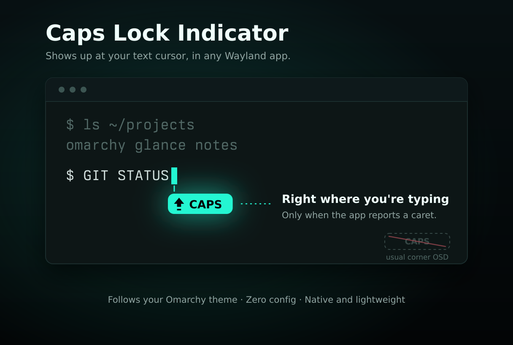

# Caps Lock Indicator

A macOS-style Caps Lock pill drawn right at the text caret, in any Wayland app,
filled with your Omarchy theme's accent color (it follows theme changes live).

It appears **only** when a text field has focus, the app has reported its caret
position, and Caps Lock is on. If an app doesn't report a caret, nothing is shown.

## How it works

`capsim` is a tiny Wayland `input-method-v2` client. The compositor places its
popup surface at the focused caret, and the popup holds the pill. Caps state
comes from `/sys/class/leds/*::capslock`. The service builds the binary on first
run (`build.sh`) and restarts it if it exits.

## Install

    omarchy plugin add https://github.com/ramselvaraj/omarchy-caps-indicator --enable

That's it. On first run the plugin builds itself and applies the setup below.
Log out and in once so Qt apps pick up the new input-method setting.

## Caveats

- Only one input method can own the keyboard seat, so this **replaces fcitx5**:
  on start the plugin disables `omarchy-fcitx5.service`. The bar's
  keyboard-layout widget depends on fcitx5 and may stop working.
- Qt apps default to the fcitx plugin, so the plugin writes
  `~/.config/environment.d/99-capsim.conf` (`QT_IM_MODULE=wayland`) so they talk
  to the compositor directly.
- Apps drawing their own text fields without text-input support won't show it.

## Undo

    omarchy plugin disable ramselvaraj.caps-indicator
    rm ~/.config/environment.d/99-capsim.conf
    systemctl --user enable --now omarchy-fcitx5.service
